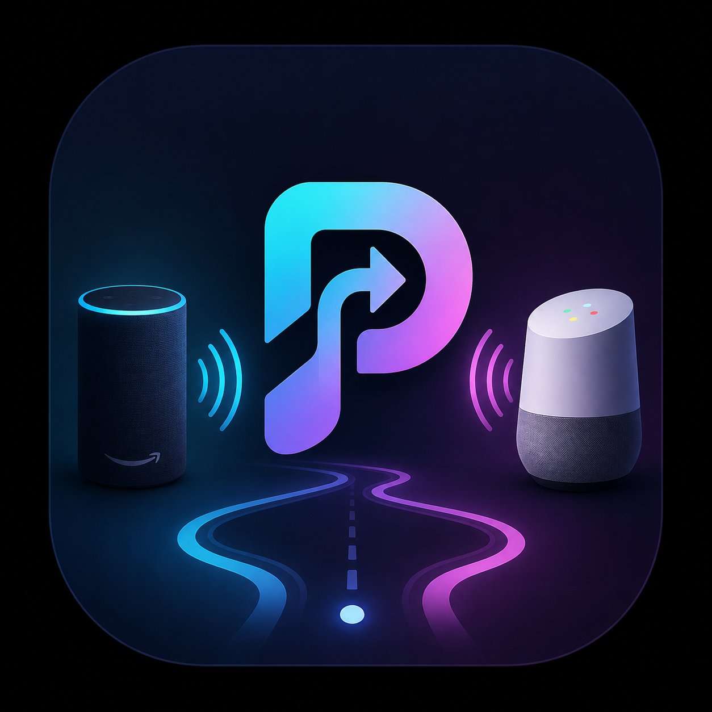

# ProxiTune



ProxiTune is a local-only remote for Windows audio. Your Echo and Google Home
stay connected to the laptop as Bluetooth audio devices. A Windows companion
app exposes safe controls on home Wi-Fi, and the Android app pairs once with a
QR code.

The supported product is deliberately manual: choose the output speaker from
your phone, then control the current Windows media session (Spotify, YouTube,
VLC, and other apps that expose Windows media controls). Automatic room
proximity switching is archived under [`experimental/`](experimental/).

## Requirements

- Windows 10/11 with Echo and Google Home paired as audio outputs.
- Python 3.11 or newer (Python 3.13 is recommended).
- Android 8+ phone on the same Wi-Fi network as the laptop.

Python 3.10 is intentionally rejected. If you see `Package 'proxitune'
requires a different Python: 3.10.5 not in '>=3.11'`, install a newer Python
and create the virtual environment with that interpreter.

## Windows setup

```bat
py -3.13 -m venv venv
venv\Scripts\activate
python -m pip install --upgrade pip
pip install -e ".[windows,desktop,dev]"
```

Create your machine-specific configuration and fill in the endpoint IDs:

```bat
copy config.example.json config.json
python -m proxitune.audio
```

Use the IDs printed by the last command for `echo`, `google`, and `laptop` in
`config.json`. The file is ignored by Git because endpoint IDs are unique to a
Windows installation.

## Start the Windows companion

```bat
python -m proxitune.desktop
```

The app finds the laptop's Wi-Fi address, starts the local controller on port
8765, and displays a QR code. Scan it from the Android app. The checkbox in
the Windows window optionally registers ProxiTune to start minimized with
Windows; leave it unchecked if you prefer to launch it yourself.

If Windows Firewall asks whether Python may accept connections, allow it on
your private/home network. Never expose port 8765 to the public internet.

For a standalone executable, install the desktop extra and run:

```bat
venv\Scripts\python.exe -m pip install -e ".[windows,desktop]"
.\tools\build_windows.ps1
```

The generated executable uses the ProxiTune artwork for its Windows icon and
tray icon. When `config.json` exists during a local build, it is bundled into
the executable; otherwise the app lets you choose the file with **Choose
config.json** on first launch. Running from the virtual environment is the
recommended development workflow.

## Android remote

Build and install the Android app (Android Studio can open the `android/`
folder, or use the wrapper):

```bat
cd android
gradlew.bat assembleDebug
```

Install `app\build\outputs\apk\debug\app-debug.apk` on your phone. Tap
**Scan Windows QR Code**, scan the code shown by the Windows companion, and
the pairing is saved on the phone. The app then offers Echo, Google Home, and
laptop output buttons plus previous, play/pause, and next controls.

Both speakers are connected to the **laptop**, not the phone. The phone is
only a Wi-Fi remote; Windows performs the endpoint switch and media command.

## Command-line fallback

The graphical companion is the normal path. The local web controller remains
available for troubleshooting:

```bat
python -m proxitune.companion --config config.json --token "long-random-token"
```

Open the printed URL on a phone connected to the same Wi-Fi. Direct endpoint
switching is also available:

```bat
python -m proxitune.audio --set-default "{WINDOWS-ENDPOINT-ID}"
```

The controller initializes Windows COM separately for every request thread,
avoiding the `CoInitialize has not been called` error.

## Tests

```bat
python -m pytest -q
```

The tests exercise authenticated zone switching and media forwarding without
requiring physical speakers. The old proximity tests live with the archived
prototype and can be run separately with `PYTHONPATH=experimental/python`.

## Project layout

```text
src/proxitune/
├── audio.py       Windows endpoint discovery and switching
├── companion.py   Authenticated local HTTP API
├── desktop.py     Windows QR/tray companion UI
└── media.py       Windows media-session controls
android/           Main Android QR-paired remote
experimental/      Archived proximity/BLE prototype and documentation
config.example.json
```

ProxiTune has no cloud service. The token is generated locally and stored in
`%LOCALAPPDATA%\ProxiTune\state.json`; regenerate it from the Windows app if
you need to invalidate a previously paired phone.
